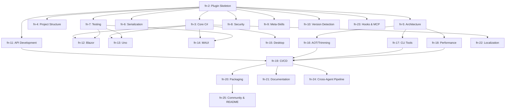

# dotnet-artisan: Umbrella Epic

## Overview

This is the umbrella epic tracking the complete dotnet-artisan plugin - a comprehensive .NET coding agent skills plugin for Claude Code with cross-agent Copilot/Codex support.

**Authoritative spec:** `docs/dotnet-artisan-spec.md`

## Architecture



## Epic Decomposition

### Wave 0: Foundation (blocks all)
| Epic | Title                            | Tasks |
|------|----------------------------------|-------|
| fn-2 | Plugin Skeleton & Infrastructure | 6     |

### Wave 1: Core Skills (parallel after fn-2)
| Epic  | Title                               | Skills             |
|-------|-------------------------------------|--------------------|
| fn-3  | Core C# & Language Patterns         | 7 skills + 1 agent |
| fn-4  | Project Structure & Scaffolding     | 6 skills           |
| fn-5  | Architecture Patterns               | 5 skills           |
| fn-6  | Serialization & Communication       | 4 skills           |
| fn-7  | Testing Foundation                  | 10 skills          |
| fn-8  | Security Skills                     | 3 skills + 1 agent |
| fn-9  | Agent Meta-Skills                   | 4 skills           |
| fn-10 | Version Detection & Multi-Targeting | 2 skills           |
| fn-11 | API Development                     | 4 skills           |

### Wave 2: Frameworks & Specialized (parallel after Wave 1)
| Epic  | Title                      | Skills              |
|-------|----------------------------|---------------------|
| fn-12 | Blazor Skills              | 3 skills + 1 agent  |
| fn-13 | Uno Platform Skills        | 3 skills + 1 agent  |
| fn-14 | MAUI Skills                | 2 skills + 1 agent  |
| fn-15 | Desktop Frameworks         | 4 skills            |
| fn-16 | Native AOT & Trimming      | 4 skills            |
| fn-17 | CLI Tool Development       | 7 skills            |
| fn-18 | Performance & Benchmarking | 4 skills + 2 agents |

### Wave 3: Integration & Polish (parallel after Wave 2)
| Epic  | Title                                  |
|-------|----------------------------------------|
| fn-19 | CI/CD (GitHub Actions + Azure DevOps)  |
| fn-20 | Packaging & Publishing                 |
| fn-21 | Documentation Skills                   |
| fn-22 | Localization                           |
| fn-23 | Hooks & MCP Integration                |
| fn-24 | Cross-Agent Build Pipeline             |
| fn-25 | Community Setup (README, CONTRIBUTING) |

## Critical Architectural Decisions

### Context Budget Strategy (resolves gap: 80+ skills vs 15,000 char limit)
- **Router/advisor skill** contains a compressed catalog (~50 chars per skill = ~4,000 chars for 80 skills)
- **Progressive disclosure**: Only name+description loaded initially; full SKILL.md on invoke
- **MCP Tool Search**: Auto-activates when >10% context consumed (96% reduction)
- **Validate in fn-2**: First task must prototype router skill and verify budget math

### Hook Performance Strategy (resolves gap: <5s vs dotnet format)
- `dotnet format` runs in **background** with results reported on next interaction
- `dotnet restore` runs **async** after .csproj edits
- Only **fast validation** (<1s) runs synchronously (XAML syntax, frontmatter check)
- Configurable aggressiveness: low (nothing sync), moderate (fast checks), aggressive (all sync)

### Version Detection Strategy (resolves gap: multi-targeting, caching)
- Detection runs **on first .NET file encounter** per session
- Caches per-project (keyed by solution/project path)
- Multi-targeting: **highest TFM** drives guidance, with polyfill callouts for lower TFMs
- Inconsistent files: **warn agent**, use most specific (.csproj TFM over global.json)

### Cross-Agent Feature Matrix (resolves gap: feature parity)
| Feature                | Claude Code     | Copilot             | Codex                   |
|------------------------|-----------------|---------------------|-------------------------|
| Skills                 | Full SKILL.md   | .github/skills/     | AGENTS.md sections      |
| Agents                 | Full subagents  | N/A (no equivalent) | Multi-agent worktrees   |
| Hooks                  | Full hooks.json | N/A                 | N/A                     |
| MCP                    | .mcp.json       | VS Code MCP         | N/A                     |
| Progressive disclosure | Native          | Via applyTo         | Via directory hierarchy |

Skills degrade gracefully: Claude-specific features (hooks, MCP, agents) are omitted from Copilot/Codex formats. Core skill guidance is identical across all agents.

## Execution Strategy
- **Ralph loop swarm** executes Wave 0 first
- On fn-2 completion, all Wave 1 epics unblock and execute in parallel
- Wave 2-3 epics are detailed via **plan-sync** after Wave 1 implementation
- RP review focuses on fn-2 and Wave 1 correctness

## Quick commands
```bash
# List all dotnet-artisan epics
.flow/bin/flowctl epics

# Check what's ready to work on
.flow/bin/flowctl ready --epic fn-2

# Start foundation work
.flow/bin/flowctl start fn-2.1
```

## Acceptance
- [ ] All 24 sub-epics created with proper dependency links
- [ ] Wave 0 (fn-2) fully detailed with task specs
- [ ] Wave 1 epics have task breakdowns
- [ ] Wave 2-3 epics have titles and lightweight specs
- [ ] RP review passes for Wave 0-1
- [ ] Epic dependency graph matches Wave structure
