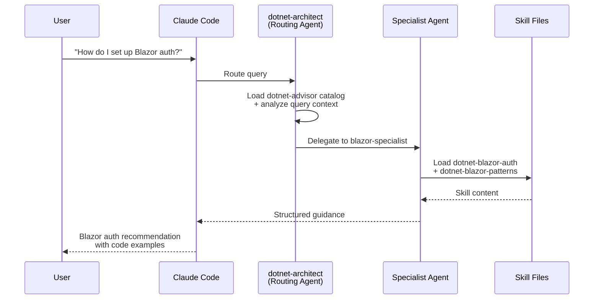

# dotnet-artisan

> Comprehensive .NET development skills for modern C#, ASP.NET, MAUI, Blazor, and cloud-native applications

[](https://github.com/novotnyllc/dotnet-marketplace/actions/workflows/validate.yml)
[](LICENSE)
[](.claude-plugin/plugin.json)

## Overview

**dotnet-artisan** is a Claude Code plugin that provides 122 skills across 22 categories and 9 specialist agents for .NET development. It follows the [Agent Skills](https://github.com/anthropics/agent-skills) open standard for skill authoring and discovery.

The plugin covers the full breadth of the .NET ecosystem:
- Modern C# patterns, async/await, dependency injection, and source generators
- ASP.NET Core APIs, Blazor, MAUI, Uno Platform, WinUI, and WPF
- Entity Framework Core, data access strategies, and serialization
- Testing with xUnit, integration testing, Playwright, and snapshot testing
- CI/CD for GitHub Actions and Azure DevOps
- Native AOT, trimming, performance profiling, and benchmarking
- Security, packaging, documentation, and release management

## Installation

Install the plugin using the Claude Code CLI:

```bash
claude plugin add novotnyllc/dotnet-marketplace
```

Once installed, Claude Code automatically loads relevant skills based on your questions about .NET development. Installation syntax may change as the Claude Code plugin system evolves.

## Skill Catalog

The plugin organizes 122 skills into 22 categories. Each skill follows the Agent Skills open standard with a `SKILL.md` file containing structured frontmatter (`name`, `description`) and rich guidance content.

| Category | Count | Example Skills |
|---|---|---|
| **Foundation** | 4 | dotnet-advisor, dotnet-version-detection, dotnet-project-analysis |
| **Core C#** | 15 | dotnet-csharp-modern-patterns, dotnet-csharp-async-patterns, dotnet-file-io, dotnet-io-pipelines, dotnet-linq-optimization |
| **Project Structure** | 6 | dotnet-project-structure, dotnet-scaffold-project, dotnet-modernize |
| **Architecture** | 15 | dotnet-architecture-patterns, dotnet-efcore-patterns, dotnet-messaging-patterns, dotnet-aspire-patterns |
| **Serialization** | 4 | dotnet-grpc, dotnet-realtime-communication, dotnet-serialization |
| **Testing** | 10 | dotnet-testing-strategy, dotnet-xunit, dotnet-integration-testing |
| **API Development** | 8 | dotnet-minimal-apis, dotnet-api-versioning, dotnet-openapi |
| **Security** | 3 | dotnet-security-owasp, dotnet-secrets-management, dotnet-cryptography |
| **Multi-Targeting** | 2 | dotnet-multi-targeting, dotnet-version-upgrade |
| **UI Frameworks** | 13 | dotnet-blazor-patterns, dotnet-maui-development, dotnet-uno-platform |
| **Native AOT** | 4 | dotnet-native-aot, dotnet-trimming, dotnet-aot-wasm |
| **CLI Tools** | 5 | dotnet-system-commandline, dotnet-cli-architecture, dotnet-cli-distribution |
| **TUI** | 2 | dotnet-terminal-gui, dotnet-spectre-console |
| **Agent Meta-Skills** | 4 | dotnet-agent-gotchas, dotnet-build-analysis, dotnet-csproj-reading |
| **Performance** | 5 | dotnet-benchmarkdotnet, dotnet-performance-patterns, dotnet-gc-memory |
| **CI/CD** | 8 | dotnet-gha-patterns, dotnet-gha-build-test, dotnet-ado-patterns |
| **Packaging** | 3 | dotnet-nuget-authoring, dotnet-msix, dotnet-github-releases |
| **Release Management** | 1 | dotnet-release-management |
| **Documentation** | 5 | dotnet-documentation-strategy, dotnet-mermaid-diagrams, dotnet-github-docs |
| **Localization** | 1 | dotnet-localization |
| **Build System** | 3 | dotnet-msbuild-authoring, dotnet-msbuild-tasks, dotnet-build-optimization |
| **AI** | 1 | dotnet-semantic-kernel |

## Agents

The plugin includes 9 specialist agents that provide focused expertise in specific domains. The central routing agent, `dotnet-architect`, analyzes your query context and delegates to the appropriate specialist.

| Agent | Description |
|---|---|
| **dotnet-architect** | Analyzes project context, requirements, and constraints to recommend architecture approaches, framework choices, and design patterns |
| **dotnet-csharp-concurrency-specialist** | Debugs race conditions, deadlocks, thread safety issues, and synchronization problems in .NET code |
| **dotnet-security-reviewer** | Reviews .NET code for security vulnerabilities, OWASP compliance, secrets exposure, and cryptographic misuse |
| **dotnet-blazor-specialist** | Guides Blazor development across all hosting models (Server, WASM, Hybrid, Auto) including components, state, and auth |
| **dotnet-uno-specialist** | Builds cross-platform Uno Platform apps with Extensions ecosystem, MVUX patterns, Toolkit controls, and MCP integration |
| **dotnet-maui-specialist** | Builds .NET MAUI apps with platform-specific development, Xamarin migration, and Native AOT on iOS/Catalyst |
| **dotnet-performance-analyst** | Analyzes profiling data, benchmark results, GC behavior, and diagnoses performance bottlenecks |
| **dotnet-benchmark-designer** | Designs BenchmarkDotNet benchmarks, prevents measurement bias, and validates benchmark methodology |
| **dotnet-docs-generator** | Generates documentation including Mermaid diagrams, XML doc skeletons, and GitHub-native docs |

## Architecture

### Plugin Structure

```mermaid
graph TB
    subgraph Plugin["dotnet-artisan Plugin"]
        direction TB
        PJ[plugin.json]

        subgraph Agents["Specialist Agents"]
            DA[dotnet-architect<br/>Central Router]
            CSC[concurrency-specialist]
            SR[security-reviewer]
            BS[blazor-specialist]
            US[uno-specialist]
            MS[maui-specialist]
            PA[performance-analyst]
            BD[benchmark-designer]
            DG[docs-generator]
        end

        subgraph Skills["22 Skill Categories / 122 Skills"]
            F[Foundation<br/>4 skills]
            CC[Core C#<br/>15 skills]
            PS[Project Structure<br/>6 skills]
            AR[Architecture<br/>15 skills]
            SE[Serialization<br/>4 skills]
            TE[Testing<br/>10 skills]
            AD[API Development<br/>8 skills]
            SC[Security<br/>3 skills]
            MT[Multi-Targeting<br/>2 skills]
            UI[UI Frameworks<br/>13 skills]
            NA[Native AOT<br/>4 skills]
            CL[CLI Tools<br/>5 skills]
            TU[TUI<br/>2 skills]
            AM[Agent Meta-Skills<br/>4 skills]
            PE[Performance<br/>5 skills]
            CI[CI/CD<br/>8 skills]
            PK[Packaging<br/>3 skills]
            RM[Release Mgmt<br/>1 skill]
            DO[Documentation<br/>5 skills]
            LO[Localization<br/>1 skill]
            BSys[Build System<br/>3 skills]
            AI[AI<br/>1 skill]
        end

        subgraph Infra["Infrastructure"]
            HK[hooks/hooks.json]
            MCP[.mcp.json]
        end
    end

    DA --> BS
    DA --> US
    DA --> MS
    DA --> CSC
    DA --> SR
    DA --> PA
    DA --> BD
    DA --> DG

    BS --> UI
    US --> UI
    MS --> UI
    CSC --> CC
    SR --> SC
    PA --> PE
    BD --> PE
    DG --> DO
    DA --> AR
    DA --> F
```



### Agent Delegation Flow



## Cross-Agent Support

dotnet-artisan supports multiple AI coding assistants through a cross-agent build pipeline. The canonical skill definitions in `skills/` are authored once using the Agent Skills open standard and then transformed into platform-specific formats. Generated outputs are deployed to GitHub Pages for stable, auto-updatable distribution.

### Distribution URLs

On each tagged release, the `dist/` directory is deployed to GitHub Pages:

| Resource | URL |
|---|---|
| **Manifest** | `https://novotnyllc.github.io/dotnet-marketplace/manifest.json` |
| **Claude Code** | `https://novotnyllc.github.io/dotnet-marketplace/claude/` |
| **GitHub Copilot** | `https://novotnyllc.github.io/dotnet-marketplace/copilot/` |
| **OpenAI Codex** | `https://novotnyllc.github.io/dotnet-marketplace/codex/` |

### Auto-Update Polling

Consumers can poll `manifest.json` to detect new releases and auto-update their local copies. The manifest includes version, timestamp, and per-target SHA256 checksums:

```json
{
  "version": "1.2.3",
  "generated_at": "2026-02-14T12:00:00Z",
  "targets": {
    "claude": { "path": "claude/", "sha256": "<checksum>" },
    "copilot": { "path": "copilot/", "sha256": "<checksum>" },
    "codex": { "path": "codex/", "sha256": "<checksum>" }
  }
}
```

**Polling contract:**
- Poll `manifest.json` no more than every **15 minutes**
- GitHub Pages CDN has an approximate **10-minute TTL** -- content may take up to 10 minutes to propagate after a release
- Compare `version` or `sha256` fields to detect updates; download only changed targets

### One-Time Repository Setup

To enable GitHub Pages deployment for a fork or new instance:

1. Go to **Settings** > **Pages** in your GitHub repository
2. Under **Source**, select **Deploy from GitHub Actions** (not "Deploy from a branch")
3. No further configuration is needed -- the `release.yml` workflow handles deployment automatically on tag push

### Private Repository Considerations

GitHub Pages requires the repository to be **public** (or requires GitHub Pro/Enterprise for private repositories). For private repositories, consumers can use the GitHub API to fetch release assets directly as a fallback. The GitHub Release is still created on each tag push for changelog notes.

### Pipeline Overview

The `scripts/generate_dist.py` script reads canonical `SKILL.md` files and produces output in the `dist/` directory:

| Target | Directory | Description |
|---|---|---|
| **Claude Code** | `dist/claude/` | Native plugin format with `plugin.json`, agents, and hooks |
| **GitHub Copilot** | `dist/copilot/` | Copilot-compatible skill format |
| **OpenAI Codex** | `dist/codex/` | Codex-compatible skill format with `AGENTS.md` |

### Transformation Rules

During generation, the pipeline applies several transformations to ensure compatibility:

- **Cross-references** (`[skill:skill-name]`) are resolved to platform-appropriate links or inline text
- **Agent-specific directives** are omitted for platforms that do not support agent delegation
- **Hook and MCP references** are omitted for platforms that do not support these features
- **Manifest generation** produces `dist/manifest.json` with version, timestamp, and per-target SHA256 checksums
- **Validation** via `scripts/validate_cross_agent.py` ensures all generated outputs conform to their target platform's requirements (including manifest schema and checksum correctness)

The CI workflow (`validate.yml`) runs both generation and conformance validation on every push and pull request. The release workflow (`release.yml`) deploys validated outputs to GitHub Pages on tag push.

## Usage Examples

**Ask about project architecture:**
> "I have a new .NET 9 web API project. What architecture pattern should I use for a medium-sized e-commerce backend?"

Claude Code loads `dotnet-architecture-patterns` and `dotnet-project-structure` to recommend a clean architecture approach with specific project layout, middleware pipeline, and dependency injection configuration.

**Debug a concurrency issue:**
> "I'm getting intermittent failures in my background service that processes messages from a queue. Sometimes messages are processed twice."

The `dotnet-csharp-concurrency-specialist` agent activates, loading `dotnet-csharp-async-patterns` and `dotnet-background-services` to diagnose the race condition and recommend idempotency patterns.

**Set up CI/CD:**
> "Help me create a GitHub Actions workflow that builds, tests, and publishes my NuGet package."

Claude Code loads `dotnet-gha-build-test` and `dotnet-gha-publish` to generate a complete workflow with proper versioning, test matrix, and NuGet push configuration.

## Contributing

See [CONTRIBUTING.md](CONTRIBUTING.md) for the skill authoring guide, PR process, and validation requirements.

## Acknowledgements

- The [Claude Code plugin system](https://docs.anthropic.com/en/docs/claude-code/plugins) and [Agent Skills](https://github.com/anthropics/agent-skills) open standard for enabling structured, discoverable development skills
- The [.NET community and ecosystem](https://dotnet.microsoft.com/) for the frameworks, libraries, and patterns documented in these skills
- All [contributors](https://github.com/novotnyllc/dotnet-marketplace/graphs/contributors) who help improve and expand the plugin

## License

This project is licensed under the MIT License. See the [LICENSE](LICENSE) file for details.
