# dotnet-marketplace

> A Claude Code plugin marketplace for .NET development

[](https://github.com/novotnyllc/dotnet-marketplace/actions/workflows/validate.yml)
[](LICENSE)

## Overview

**dotnet-artisan** is a Claude Code plugin that provides 130 skills across 22 categories and 14 specialist agents for .NET development. It follows the [Agent Skills](https://github.com/anthropics/agent-skills) open standard for skill authoring and discovery.

## Available Plugins

| Plugin | Description | Skills | Agents |
|---|---|---|---|
| [**dotnet-artisan**](plugins/dotnet-artisan/) | Comprehensive .NET development skills for modern C#, ASP.NET, MAUI, Blazor, and cloud-native applications | 130 | 14 |

## Installation

### From within Claude Code (recommended)

Run the `/plugin` slash command inside a Claude Code session:

```
/plugin marketplace add novotnyllc/dotnet-marketplace
```

This adds the marketplace and makes all dotnet-artisan skills and agents available immediately. You can also run `/plugin` to browse an interactive UI for discovering and installing plugins.

### From the terminal CLI

```bash
claude plugin install dotnet-artisan@dotnet-marketplace
```

> **Note:** Close the Claude desktop app before installing. Running both Claude Code (terminal) and the desktop app simultaneously can cause `EBUSY: resource busy or locked` errors.

Installation syntax may change as the Claude Code plugin system evolves. Requires Claude Code v1.0.33+.

## Repository Structure

The plugin organizes 130 skills into 22 categories. Each skill follows the Agent Skills open standard with a `SKILL.md` file containing structured frontmatter (`name`, `description`) and rich guidance content.

| Category | Count | Example Skills |
|---|---|---|
| **Foundation** | 4 | dotnet-advisor, dotnet-version-detection, dotnet-project-analysis, dotnet-file-based-apps |
| **Core C#** | 18 | dotnet-csharp-modern-patterns, dotnet-csharp-async-patterns, dotnet-csharp-concurrency-patterns, dotnet-csharp-type-design-performance, dotnet-native-interop, dotnet-file-io, dotnet-io-pipelines, dotnet-linq-optimization |
| **Project Structure** | 7 | dotnet-project-structure, dotnet-scaffold-project, dotnet-artifacts-output, dotnet-modernize |
| **Architecture** | 15 | dotnet-architecture-patterns, dotnet-efcore-patterns, dotnet-messaging-patterns, dotnet-aspire-patterns |
| **Serialization** | 4 | dotnet-grpc, dotnet-realtime-communication, dotnet-serialization |
| **Testing** | 10 | dotnet-testing-strategy, dotnet-xunit, dotnet-integration-testing |
| **API Development** | 9 | dotnet-minimal-apis, dotnet-api-versioning, dotnet-openapi, dotnet-csharp-api-design |
| **Security** | 3 | dotnet-security-owasp, dotnet-secrets-management, dotnet-cryptography |
| **Multi-Targeting** | 2 | dotnet-multi-targeting, dotnet-version-upgrade |
| **UI Frameworks** | 14 | dotnet-blazor-patterns, dotnet-maui-development, dotnet-uno-platform, dotnet-accessibility |
| **Native AOT** | 4 | dotnet-native-aot, dotnet-trimming, dotnet-aot-wasm |
| **CLI Tools** | 6 | dotnet-system-commandline, dotnet-cli-architecture, dotnet-cli-distribution, dotnet-tool-management |
| **TUI** | 2 | dotnet-terminal-gui, dotnet-spectre-console |
| **Agent Meta-Skills** | 5 | dotnet-agent-gotchas, dotnet-build-analysis, dotnet-csproj-reading, dotnet-slopwatch |
| **Performance** | 5 | dotnet-benchmarkdotnet, dotnet-performance-patterns, dotnet-gc-memory |
| **CI/CD** | 8 | dotnet-gha-patterns, dotnet-gha-build-test, dotnet-ado-patterns |
| **Packaging** | 3 | dotnet-nuget-authoring, dotnet-msix, dotnet-github-releases |
| **Release Management** | 1 | dotnet-release-management |
| **Documentation** | 5 | dotnet-documentation-strategy, dotnet-mermaid-diagrams, dotnet-github-docs |
| **Localization** | 1 | dotnet-localization |
| **Build System** | 3 | dotnet-msbuild-authoring, dotnet-msbuild-tasks, dotnet-build-optimization |
| **AI** | 1 | dotnet-semantic-kernel |

## Agents

The plugin includes 14 specialist agents that provide focused expertise in specific domains. The central routing agent, `dotnet-architect`, analyzes your query context and delegates to the appropriate specialist.

| Agent | Description |
|---|---|
| **dotnet-architect** | Analyzes project context, requirements, and constraints to recommend architecture approaches, framework choices, and design patterns |
| **dotnet-aspnetcore-specialist** | ASP.NET Core web API development, middleware, and hosting patterns |
| **dotnet-async-performance-specialist** | Async/await performance analysis, task scheduling, and concurrency optimization |
| **dotnet-benchmark-designer** | Designs BenchmarkDotNet benchmarks, prevents measurement bias, and validates benchmark methodology |
| **dotnet-blazor-specialist** | Guides Blazor development across all hosting models (Server, WASM, Hybrid, Auto) including components, state, and auth |
| **dotnet-cloud-specialist** | Cloud-native .NET patterns for Azure, AWS, and containerized deployments |
| **dotnet-code-review-agent** | Automated code review for .NET projects with focus on quality, patterns, and best practices |
| **dotnet-csharp-concurrency-specialist** | Debugs race conditions, deadlocks, thread safety issues, and synchronization problems in .NET code |
| **dotnet-docs-generator** | Generates documentation including Mermaid diagrams, XML doc skeletons, and GitHub-native docs |
| **dotnet-maui-specialist** | Builds .NET MAUI apps with platform-specific development, Xamarin migration, and Native AOT on iOS/Catalyst |
| **dotnet-performance-analyst** | Analyzes profiling data, benchmark results, GC behavior, and diagnoses performance bottlenecks |
| **dotnet-security-reviewer** | Reviews .NET code for security vulnerabilities, OWASP compliance, secrets exposure, and cryptographic misuse |
| **dotnet-testing-specialist** | Testing strategy, test architecture, and quality patterns for .NET projects |
| **dotnet-uno-specialist** | Builds cross-platform Uno Platform apps with Extensions ecosystem, MVUX patterns, Toolkit controls, and MCP integration |

## Architecture

### Plugin Structure

```mermaid
graph TB
    subgraph Plugin["dotnet-artisan Plugin"]
        direction TB
        PJ[plugin.json]

        subgraph Agents["14 Specialist Agents"]
            DA[dotnet-architect<br/>Central Router]
            ASP[aspnetcore-specialist]
            APF[async-performance-specialist]
            CSC[concurrency-specialist]
            SR[security-reviewer]
            BS[blazor-specialist]
            US[uno-specialist]
            MS[maui-specialist]
            CS[cloud-specialist]
            CR[code-review-agent]
            PA[performance-analyst]
            BD[benchmark-designer]
            DG[docs-generator]
            TS[testing-specialist]
        end

        subgraph Skills["22 Skill Categories / 130 Skills"]
            F[Foundation<br/>4 skills]
            CC[Core C#<br/>18 skills]
            PS[Project Structure<br/>7 skills]
            AR[Architecture<br/>15 skills]
            SE[Serialization<br/>4 skills]
            TE[Testing<br/>10 skills]
            AD[API Development<br/>9 skills]
            SC[Security<br/>3 skills]
            MT[Multi-Targeting<br/>2 skills]
            UI[UI Frameworks<br/>14 skills]
            NA[Native AOT<br/>4 skills]
            CL[CLI Tools<br/>6 skills]
            TU[TUI<br/>2 skills]
            AM[Agent Meta-Skills<br/>5 skills]
            PE[Performance<br/>5 skills]
            CI[CI/CD<br/>8 skills]
            PK[Packaging<br/>3 skills]
            RM[Release Mgmt<br/>1 skill]
            DO[Documentation<br/>5 skills]
            LO[Localization<br/>1 skill]
            BSys[Build System<br/>3 skills]
            AI[AI<br/>1 skill]
        end

        subgraph Infra["Infrastructure"]
            HK[hooks/hooks.json]
            MCP[.mcp.json]
        end
    end

    DA --> ASP
    DA --> APF
    DA --> BS
    DA --> US
    DA --> MS
    DA --> CS
    DA --> CSC
    DA --> CR
    DA --> SR
    DA --> PA
    DA --> BD
    DA --> DG
    DA --> TS

    ASP --> AD
    BS --> UI
    US --> UI
    MS --> UI
    CSC --> CC
    SR --> SC
    PA --> PE
    BD --> PE
    DG --> DO
    TS --> TE
    DA --> AR
    DA --> F
```


```
/
+-- .claude-plugin/
|   +-- marketplace.json          # Root marketplace listing
+-- plugins/
|   +-- dotnet-artisan/           # Self-contained plugin
|       +-- .claude-plugin/       # Plugin manifest and metadata
|       +-- skills/               # 130 skills (22 categories)
|       +-- agents/               # 14 specialist agents
|       +-- hooks/                # Session hooks
|       +-- scripts/              # Validation scripts
|       +-- ...
+-- .github/workflows/            # CI/CD
+-- CONTRIBUTING.md               # Contribution guide
+-- CHANGELOG.md                  # Release history
+-- LICENSE                       # MIT
```

## Usage Examples

**Ask about project architecture:**
> "I have a new .NET 9 web API project. What architecture pattern should I use for a medium-sized e-commerce backend?"

Claude Code loads `dotnet-architecture-patterns` and `dotnet-project-structure` to recommend a clean architecture approach with specific project layout, middleware pipeline, and dependency injection configuration.

**Debug a concurrency issue:**
> "I'm getting intermittent failures in my background service that processes messages from a queue. Sometimes messages are processed twice."

The `dotnet-csharp-concurrency-specialist` agent activates, loading `dotnet-csharp-async-patterns` and `dotnet-background-services` to diagnose the race condition and recommend idempotency patterns.

**Set up CI/CD:**
> "Help me create a GitHub Actions workflow that builds, tests, and publishes my NuGet package."

Claude Code loads `dotnet-gha-build-test` and `dotnet-gha-publish` to generate a complete workflow with proper versioning, test matrix, and NuGet push configuration.

## Contributing

See [CONTRIBUTING.md](CONTRIBUTING.md) for the contribution guide, PR process, and validation requirements.

For plugin-specific skill authoring guidance, see [plugins/dotnet-artisan/CONTRIBUTING-SKILLS.md](plugins/dotnet-artisan/CONTRIBUTING-SKILLS.md).

## License

This project is licensed under the MIT License. See the [LICENSE](LICENSE) file for details.
