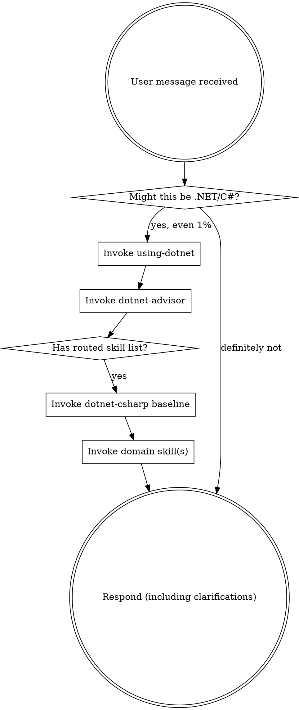

# using-dotnet

<EXTREMELY-IMPORTANT>
If you think there is even a 1% chance the request is .NET/C#, you MUST invoke this skill and follow its sequence.

If .NET routing applies, you do not have discretion to skip [skill:dotnet-advisor] or defer it until after exploration.

This is mandatory process discipline for dotnet-artisan.
</EXTREMELY-IMPORTANT>

## Scope

- Establishing .NET/C# routing discipline before clarifying questions, planning, command execution, or edits.
- Detecting .NET intent from prompt and repository signals (`.sln`, `.slnx`, `.csproj`, `global.json`, `.cs`).
- Enforcing first-step routing through [skill:dotnet-advisor] and baseline loading order.
- Defining priority and rigidity rules for downstream skill invocation.

## Out of scope

- C# implementation details and coding-standard specifics -> [skill:dotnet-csharp]
- Deep domain implementation patterns -> [skill:dotnet-api], [skill:dotnet-ui], [skill:dotnet-testing], [skill:dotnet-devops], [skill:dotnet-tooling], [skill:dotnet-debugging]
- Specialist deep-review workflows -> [skill:dotnet-security-reviewer], [skill:dotnet-performance-analyst], [skill:dotnet-testing-specialist]

## How to Access Skills

**In Claude Code:** Use the `Skill` tool. When you invoke a skill, follow the loaded instructions directly.

**In other environments:** Use that platform's skill invocation mechanism and load the same skill bodies.

# Using Skills

## The Rule

**Invoke relevant or requested skills BEFORE any response or action.** If there is even a 1% chance the request is .NET/C#, invoke this skill first, then invoke [skill:dotnet-advisor].

## Red Flags

These thoughts mean STOP. You are rationalizing around required routing discipline.

| Thought | Reality |
|---------|---------|
| "This is just a simple question" | Questions are tasks. Run routing first. |
| "I need more context first" | Skill check comes before clarifying questions. |
| "Let me explore the codebase first" | Routing determines how to explore safely. |
| "I can run a quick command first" | Commands are execution. Route first. |
| "I remember the routing rules" | Skills evolve. Invoke current version. |
| "This doesn't need a formal skill" | If a skill applies, use it. |
| "This might not be .NET" | If there is a credible chance, run this process. |
| "I'll just do one thing first" | Routing comes before any action. |

## Skill Priority

When multiple skills could apply, use this order:

1. **Process skills first**: this skill, then [skill:dotnet-advisor].
2. **Baseline skill second**: [skill:dotnet-csharp] for any code path.
3. **Domain skills third**: [skill:dotnet-api], [skill:dotnet-ui], [skill:dotnet-testing], [skill:dotnet-devops], [skill:dotnet-tooling], [skill:dotnet-debugging].
4. **Specialist agents fourth**: use only when deeper analysis is required after routing.

## Skill Types

**Rigid** (must follow exactly): this skill, [skill:dotnet-advisor], and baseline-first ordering.

**Flexible** (adapt to context): Domain skills and their companion references.

User instructions define WHAT to do. This process defines HOW to route and load skills before execution.
